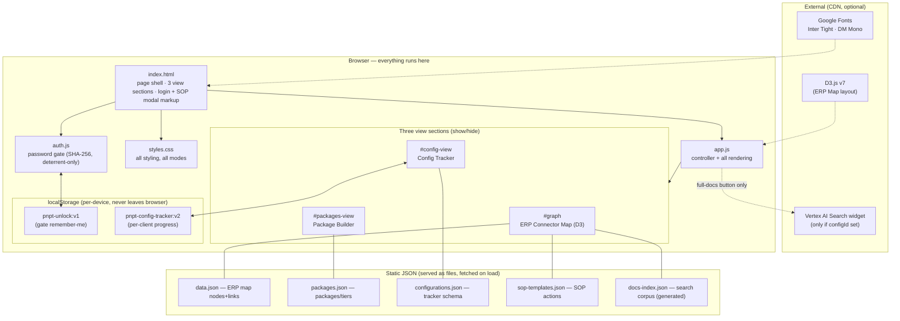
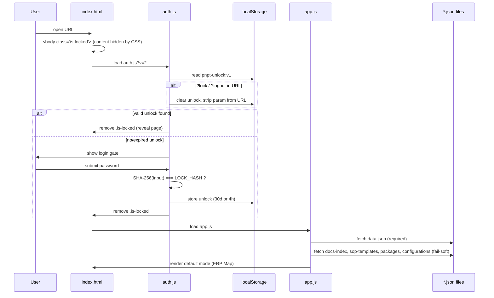
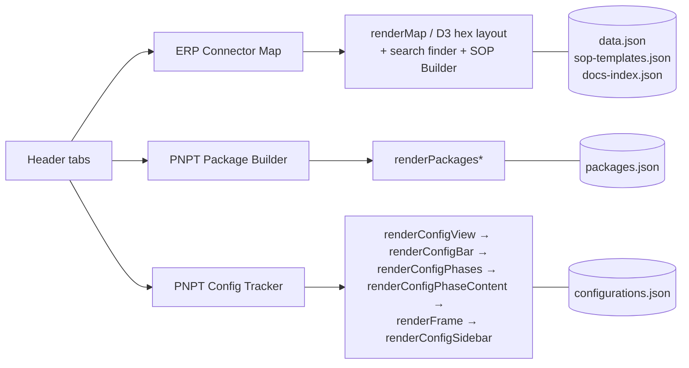
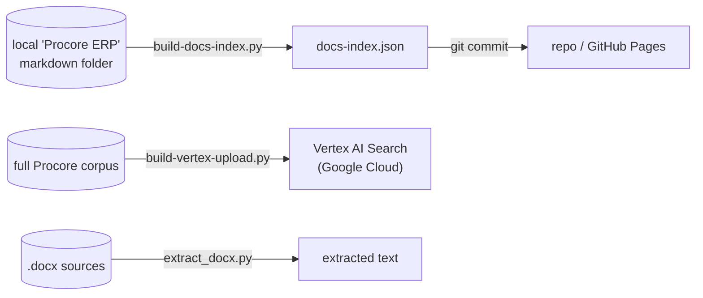

# Architecture Map

How the pieces of the PNPT Tools site fit together at runtime. For *where to
edit what*, see the table in the [README](README.md#architecture--what-edits-what);
this doc explains *how it runs*.

**One-sentence model:** a single static HTML page loads one stylesheet, one
gate script, and one app script; the app script fetches several JSON files and
renders one of three "modes" into the page. There is no server, no build, and
no framework — everything below runs in the browser.

---

## 1. System map (runtime)



**Reading it:** `index.html` is the shell. `auth.js` gates the whole page
before `app.js` renders anything. `app.js` is the single controller — it
fetches the JSON, owns all three view sections, and writes user state to
`localStorage`. Dotted edges are optional (the site works without them).

---

## 2. Boot sequence

What happens, in order, on a page load:



Key points:
- The page is **hidden by default** (`<body class="is-locked">` + CSS). The gate
  *reveals* it; it does not load content on demand. That's why it's a deterrent
  — the markup and scripts are already downloaded.
- `auth.js` is cache-busted (`?v=2`) so password/logic changes take effect
  without users having to hard-refresh.
- Only `data.json` is required. The other four fetches **fail soft** — if a file
  is missing, the feature that uses it just stays empty and the page still works.

**Load order:**
`data.json` → `docs-index.json` → `sop-templates.json` → `packages.json` → `configurations.json`

---

## 3. Mode switching (runtime, no router)

Three header tabs toggle which `<section>` is visible. There is no URL routing —
it's pure show/hide driven by `app.js`.



```
┌─────────────────────────────────────────────────────────────────┐
│ HEADER:  [ ERP Connector Map ] [ Package Builder ] [ Config Tracker ] │
└─────────────────────────────────────────────────────────────────┘
            │                     │                      │
            ▼                     ▼                      ▼
   #graph + #details      #packages-view          #config-view
   (D3 bipartite map)     (capability graph)      (phase tracker)
            │                     │                      │
        data.json            packages.json        configurations.json
     sop-templates.json
       docs-index.json
```

Each mode's render functions live in `app.js`, grouped by name prefix
(`renderPackages*`, `renderConfig*`). The ERP Map is the only mode that uses D3;
the other two are plain DOM/SVG.

---

## 4. Two features worth knowing

### SOP Builder ("Generate Word document")
No library and no backend. `app.js` builds an **HTML string** styled for Word,
wraps it in a `Blob({ type: "application/msword" })`, and triggers a download as
a `.doc`. Word opens it natively. Actions come from `sop-templates.json` keyed by
ERP tool; the user assigns owners in the modal before generating.

### Search finder + Vertex (two layers)
- **Layer 1 (always on):** the "Search connectors, data objects, errors…" box
  searches `docs-index.json` (a generated corpus) plus the inline `data.json`
  notes. Pure client-side string matching.
- **Layer 2 (optional):** if `data.json` carries a Vertex `configId`, `app.js`
  injects a Google `<gen-search-widget>` for conversational search over the full
  Procore corpus. If no config id, the button stays hidden and there is zero
  Google Cloud dependency.

---

## 5. Offline build pipeline (tools/)

These Python scripts are **not** part of the deployed site and never run in the
browser. They regenerate data files that are then committed like any other file.



You only need `tools/` when refreshing the search corpus. For normal content
edits (ERPs, packages, tracker content) you never touch them — the committed
`docs-index.json` is all the site needs.

---

## 6. State & persistence

There is **no database**. All user state is browser-local:

| Key | Set by | Holds | Lifetime |
|---|---|---|---|
| `pnpt-unlock:v1` | `auth.js` | proof the user entered the password | 30 days (remember-me) or 4 hours |
| `pnpt-config-tracker:v2` | `app.js` | every client's tracker progress: `{ schema, activeClientId, clients: {…} }` | until browser data is cleared |

Implications:
- Progress is **per-device, per-browser**. It does not sync between machines and
  is not backed up. Clearing site data wipes it.
- `pnpt-config-tracker:v2` supersedes a `:v1` key; `app.js` migrates v1→v2 on load.
- Nothing here is sent anywhere — there is no server to send it to.

---

## 7. Deploy path

```
edit file → git commit → git push origin main → GitHub Pages rebuild (~60s) → live
```

GitHub Pages serves `main` at root. No CI, no build step, no artifacts —
the repo *is* the deployed site.
