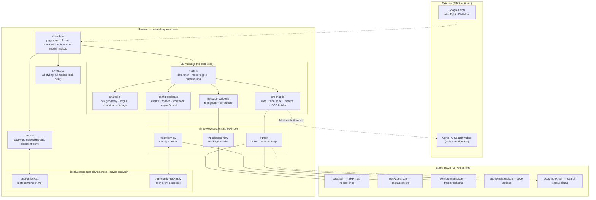
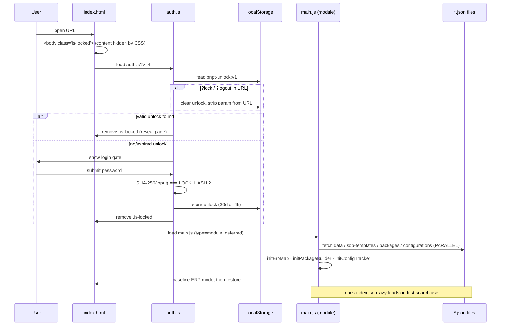
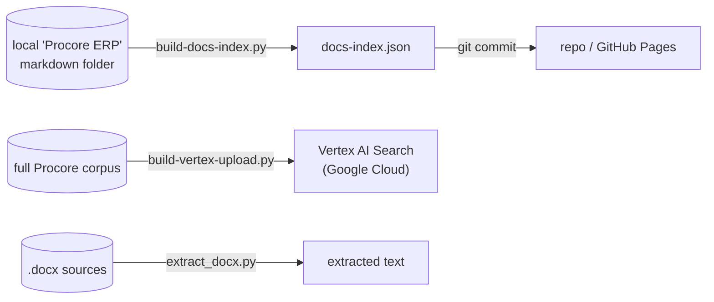

# Architecture Map

How the pieces of the PNPT Tools site fit together at runtime. For *where to
edit what*, see the table in the [README](README.md#architecture--what-edits-what);
this doc explains *how it runs*.

**One-sentence model:** a single static HTML page loads one stylesheet, one
gate script, and one ES-module entry point; the entry point fetches several
JSON files, hands each of three view modules its data, and routes between them
via the URL hash. There is no server, no build, and no framework — everything
below runs in the browser.

---

## 1. System map (runtime)



**Reading it:** `index.html` is the shell. `auth.js` gates the whole page
before anything renders. `main.js` is the entry module — it fetches the JSON
payloads, calls each view module's `init(ctx)` with its data, and owns the
mode toggle plus hash routing. Each view module returns a tiny public API
(`initErpMap` → `{selectNode, deselect, setSource, revealNode}`,
`initPackageBuilder` → `{renderPackagesView, setActivePackage, …}`,
`initConfigTracker` → `{renderConfigView}`); everything else stays private to
its module. `shared.js` holds the cross-view utilities: hex geometry, the SVG
element factory, one wheel-zoom/drag-pan implementation used by both graphs
(vanilla — D3 was dropped), and the in-app dialog system. Dotted edges are
optional (the site works without them).

---

## 2. Boot sequence

What happens, in order, on a page load:



Key points:
- The page is **hidden by default** (`<body class="is-locked">` + CSS). The gate
  *reveals* it; it does not load content on demand. That's why it's a deterrent
  — the markup and scripts are already downloaded.
- `auth.js` is cache-busted (`?v=4`); the JSON payloads fetch with
  `cache: "no-cache"` so they revalidate (ETag → 304) instead of riding GitHub
  Pages' 10-minute cache after a deploy.
- The four startup payloads load **in parallel**. Only `data.json` is required —
  if it fails, a visible error card with a Reload button renders (no blank
  page). The others fail soft: the feature that uses them just stays empty.
- `docs-index.json` (the ~90KB-gzipped deep search corpus) is **not** fetched at
  startup; it lazy-loads the first time the search box is used.

---

## 3. Mode switching + deep links

Three header tabs toggle which `<section>` is visible, and the URL hash tracks
where you are — links are shareable:

| Hash | Restores |
|---|---|
| `#erp` | ERP Connector Map |
| `#erp/<nodeId>` | map + selected node (auto-switches connector source) |
| `#packages` / `#packages/<pkgKey>` | Package Builder (+ package) |
| `#config` | Config Tracker |

`main.js` owns `setMode()` (which also stamps `body[data-mode]` for the print
styles) and `applyHashRoute()`; Back/Forward re-route via `hashchange`.

```
┌─────────────────────────────────────────────────────────────────┐
│ HEADER:  [ ERP Connector Map ] [ Package Builder ] [ Config Tracker ] │
└─────────────────────────────────────────────────────────────────┘
            │                     │                      │
            ▼                     ▼                      ▼
   #graph + #details      #packages-view          #config-view
   (erp-map.js)           (package-builder.js)    (config-tracker.js)
            │                     │                      │
        data.json            packages.json        configurations.json
     sop-templates.json
       docs-index.json (lazy)
```

Each mode's render functions live in its module, grouped by name prefix
(`renderPackages*`, `renderConfig*`). Both graphs are plain DOM/SVG using the
shared zoom/pan helper (Ctrl/⌘ + scroll to zoom; plain scroll scrolls the page).

---

## 4. Features worth knowing

### SOP Builder ("Generate Word document")
No library and no backend. `erp-map.js` builds an **HTML string** styled for
Word, wraps it in a `Blob({ type: "application/msword" })`, and triggers a
download as a `.doc`. Word opens it natively. Actions come from
`sop-templates.json` keyed by ERP tool; the user assigns owners in the modal
before generating.

### Search finder + Vertex (two layers)
- **Layer 1 (always on):** the "Search connectors, data objects, errors…" box
  searches the inline `data.json` notes immediately, and merges in
  `docs-index.json` (a generated corpus) after its lazy load. Pure client-side
  string matching, debounced.
- **Layer 2 (optional):** if `data.json` carries a Vertex `configId`,
  `erp-map.js` injects a Google `<gen-search-widget>` for conversational search
  over the full Procore corpus. If no config id, the button stays hidden and
  there is zero Google Cloud dependency.

### Config Tracker safety rails (config-tracker.js)
- **Export / Import** buttons back up and merge the entire multi-client store
  as a dated JSON file — the only defense against localStorage loss, and the
  handoff path between SPCs.
- All progress is keyed by **stable ids** (task ids from the data; slug keys
  derived from workbook/validation row names), never by list position, with
  one-time migrations for older stores and imported backups.
- Printing the tracker produces a closeout-ready document: print CSS hides the
  chrome and a `beforeprint` hook opens collapsed sections (restored after).

---

## 5. Offline build pipeline (tools/)

These Python scripts are **not** part of the deployed site and never run in the
browser. They regenerate data files that are then committed like any other file.



You only need `tools/` when refreshing the search corpus (the `sync-*` crawlers
refresh the local doc mirrors that feed it). For normal content edits (ERPs,
packages, tracker content) you never touch them — the committed
`docs-index.json` is all the site needs.

---

## 6. State & persistence

There is **no database**. All user state is browser-local:

| Key | Set by | Holds | Lifetime |
|---|---|---|---|
| `pnpt-unlock:v1` | `auth.js` | proof the user entered the password | 30 days (remember-me) or 4 hours |
| `pnpt-config-tracker:v2` | `config-tracker.js` | every client's tracker progress: `{ schema, activeClientId, clients: {…} }` | until browser data is cleared |

Implications:
- Progress is **per-device, per-browser**. It does not sync between machines.
  The Config Tracker's **Export** button is the backup path; **Import** merges
  a backup by client id.
- `pnpt-config-tracker:v2` supersedes a `:v1` key; `config-tracker.js` migrates
  v1→v2 (and index-keyed progress → stable ids) on load.
- Writes are debounced (300ms) and flushed on tab hide, so fast typing doesn't
  hammer localStorage and the tail keystroke still survives a close.
- Nothing here is sent anywhere — there is no server to send it to.

---

## 7. Deploy path

```
edit file → git commit → git push origin main → GitHub Pages rebuild (~60s) → live
```

GitHub Pages serves `main` at root. No CI, no build step, no artifacts —
the repo *is* the deployed site.
